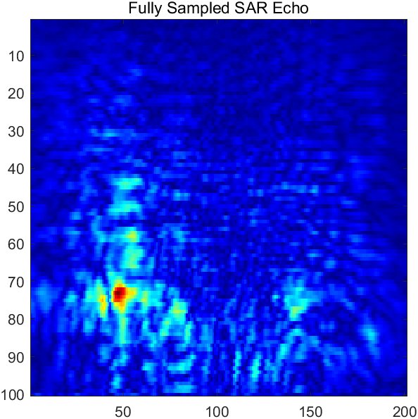
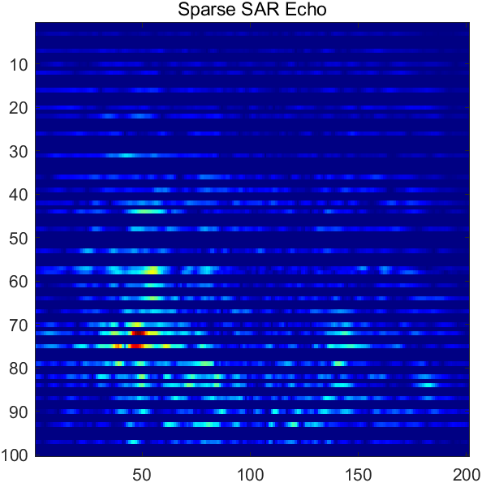
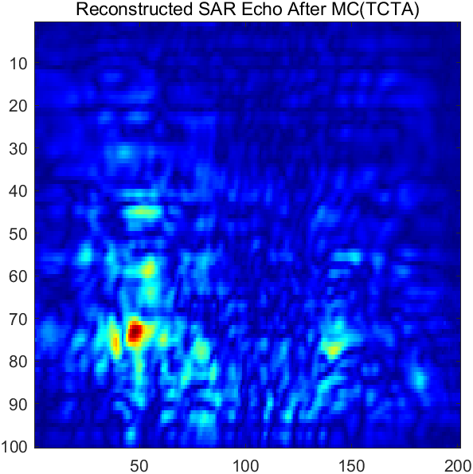
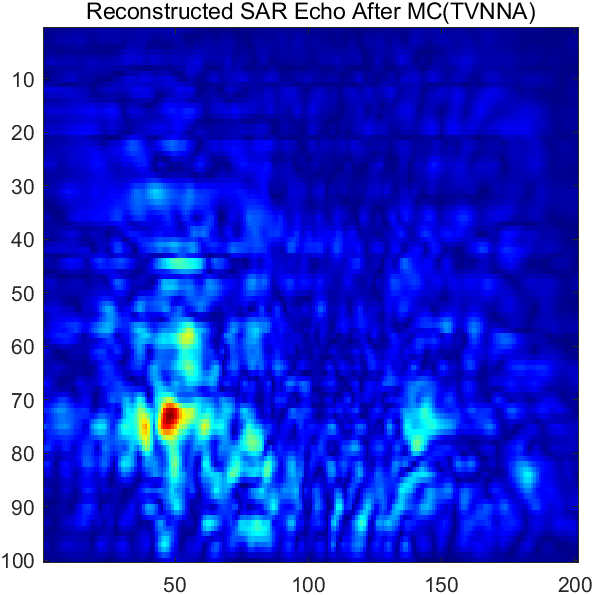
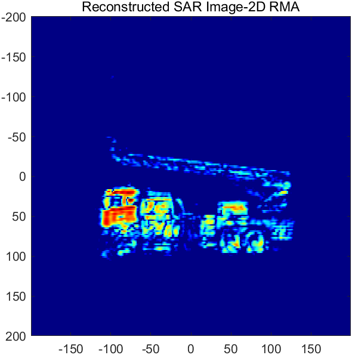
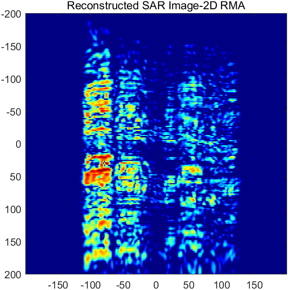
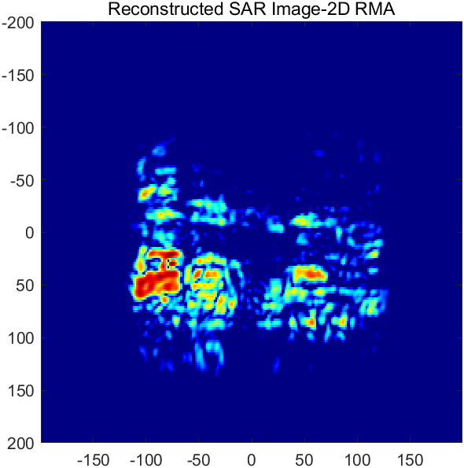
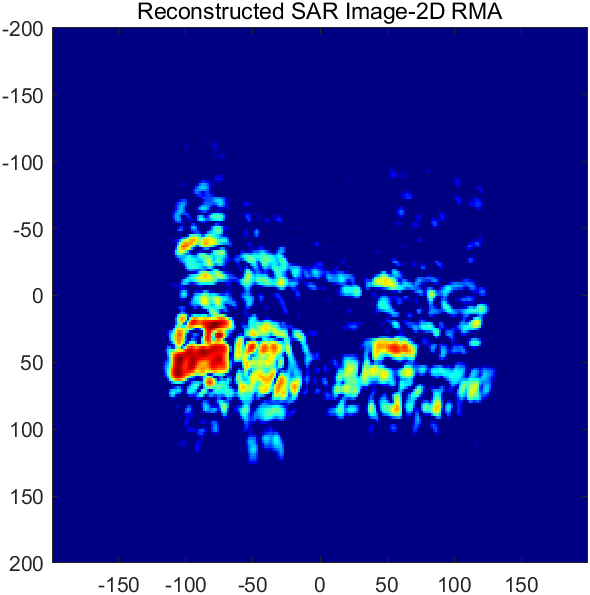

# TCTA and TVNNA for Structured Sparse mmWave 3-D SAR Imaging

This repository provides MATLAB implementations of two matrix-completion methods for structured sparse millimeter-wave (mmWave) three-dimensional synthetic aperture radar (SAR) imaging:

- **TCTA**: Toeplitz-Column-Toeplitz ADMM matrix completion, which uses a two-level Toeplitz lifting and a low-rank factorized ADMM solver without singular value decomposition in the iterative updates.
- **TVNNA**: a low-rank and smooth matrix-completion method that jointly uses second-order total variation regularization and nuclear-norm minimization in an ADMM framework.

Both methods reconstruct sparsely sampled range slices before two-dimensional range migration algorithm (RMA) imaging.

## Results

<table>
  <tr>
    <td></td>
    <td></td>
    <td></td>
    <td></td>
  </tr>
  <tr>
    <td></td>
    <td></td>
    <td></td>
    <td></td>
  </tr>
</table>

## Our Related Papers

1. Z. Tan, Z. Chen, Y. Liu, Z. Li, S. Gao, and Y. Liu, "Structured Sparse Millimeter-Wave 3-D SAR Imaging via Truncated-DCT and Toeplitz Matrix Methods," *IEEE Transactions on Aerospace and Electronic Systems*, vol. 62, 2026. DOI: [10.1109/TAES.2026.3686779](https://doi.org/10.1109/TAES.2026.3686779).

2. Z. Tan, Z. Chen, H. Tang, P. Mou, and Y. Liu, "Fast Structured Sparse Millimeter-Wave 3D SAR Imaging Based on Low-rank and Smooth Matrix Completion," *Journal of Radars*, 2026. DOI: [10.12000/JR25267](https://doi.org/10.12000/JR25267).

## Requirements

- MATLAB R2018a or later
- The supplied example data file: `sardata.mat`

## Quick Start

1. Open this repository as the MATLAB working directory.
2. Run the main script:

   ```matlab
   Main
   ```

3. Select one completion method in `Main.m`:

   ```matlab
   IS_TCTA = 1;
   IS_TVNNA = 0;
   ```

   or

   ```matlab
   IS_TCTA = 0;
   IS_TVNNA = 1;
   ```

4. Choose a sampling mask in the sparse-sampling section of `Main.m`, then run the script. It displays the fully sampled echo, sparse echo, completed echo, and reconstructed 2-D RMA image.

## Project Structure

```text
.
|-- Main.m                 main script for sampling, completion, and RMA imaging
|-- sardata.mat            example SAR range-slice data
|-- utils/
|   |-- TCTA.m             Toeplitz-Column-Toeplitz ADMM completion
|   |-- TCT.m              two-level Toeplitz lifting
|   |-- Inverse_TCT.m      inverse TCT mapping
|   |-- Inverse_SubTCT.m   inverse column-wise Toeplitz mapping
|   |-- Als_UV_Init.m      ALS factor initialization
|   |-- TVNNA.m            TV and nuclear-norm ADMM completion
|   `-- RMA_2D.m           2-D range migration imaging
`-- LICENSE
```

## Input Data

The supplied `sardata.mat` file contains a `sardata` structure with the following fields:

- `range_slice`: complex SAR range slice to be completed and imaged.
- `slice_xyz`: scan intervals (`dx`, `dy`) and the imaging distance (`distance`).
- `params`: radar and imaging parameters, including carrier frequency, propagation speed, chirp slope, sampling rate, number of samples, and spatial FFT size.

For `TCTA` and `TVNNA`, zero-valued entries in the input range slice are interpreted as unobserved samples. Therefore, construct the sampling mask before calling either completion function.

## Method Parameters

### TCTA

- `P`, `Q`: first- and second-level pencil parameters of the TCT lifting.
- `mu0`: ADMM penalty parameter.
- `e_rank`: estimated rank of the lifted TCT matrix.
- `K`: maximum ADMM iteration count.

### TVNNA

- `lambda`: second-order TV regularization weight. The example sets it to the reciprocal of the sampling rate.
- `rho`: initial ADMM penalty parameter.
- `mu1`: multiplier used to increase `rho` at each iteration.
- `maxIter`: maximum ADMM iteration count.
- `tol`: convergence threshold based on the relative Frobenius-norm change.

## Notes

- `dx` and `dy` are used in millimetres by `RMA_2D.m`.
- Ensure that the wavenumber `k` and imaging distance `z0` use compatible units in RMA phase compensation.

## License

This project is released under the terms in [LICENSE](LICENSE).
